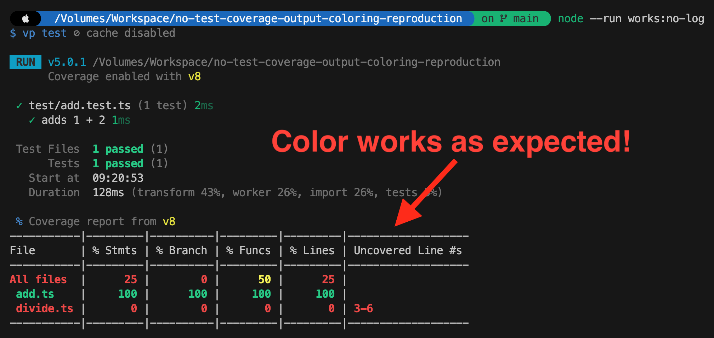
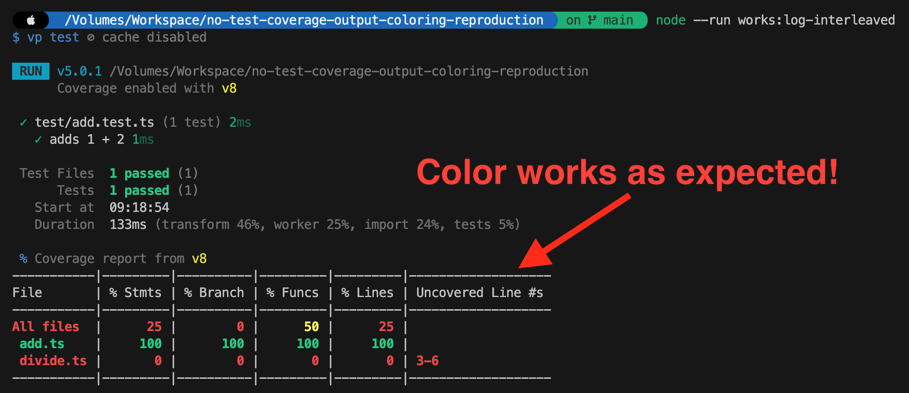
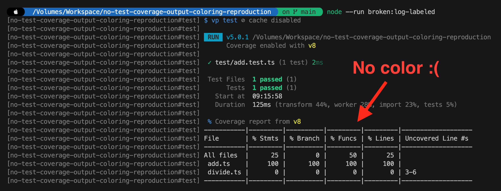
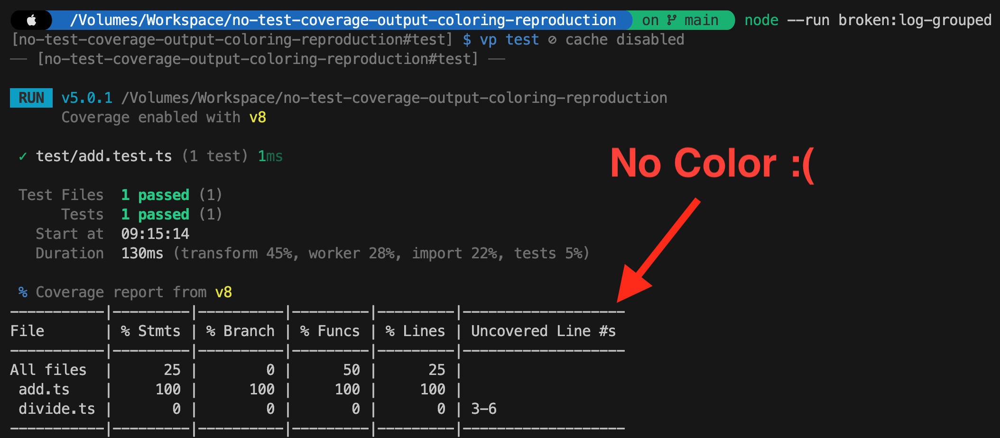

# no-test-coverage-output-coloring-reproduction

Minimal [Vite+](https://viteplus.dev) repo showing that **`vp run --log labeled` and `--log grouped` strip all ANSI color from the task's output**, including the v8 coverage report. The default `interleaved` mode keeps it.

## Requirements

- Node.js >= 22
- The global `vp` CLI:
  ```bash
  # macOS / Linux
  curl -fsSL https://vite.plus | bash

  # Windows (PowerShell)
  irm https://viteplus.dev/install.ps1 | iex
  ```

## Install

```bash
npm install --legacy-peer-deps
```

`--legacy-peer-deps` is required: npm 10.9.4 crashes with `Cannot read properties of null (reading 'edgesOut')` while resolving `vite-plus`'s optional `@vitest/browser-*` peers. `vp install` also works.

## Scripts

Every script runs the same underlying `test` script (`vp test`, Vitest with v8 coverage). Only the task runner's log mode differs.

| Script | Command | Color |
| --- | --- | --- |
| `node --run test` | `vp test` | n/a — runs Vitest directly, no task runner |
| `node --run works:no-log` | `vp run test` | preserved |
| `node --run works:log-interleaved` | `vp run --log interleaved test` | preserved |
| `node --run broken:log-labeled` | `vp run --log labeled test` | **stripped** |
| `node --run broken:log-grouped` | `vp run --log grouped test` | **stripped** |

Use `node --run <script>` rather than `npm run <script>`. It execs the script directly instead of spawning an npm wrapper process, so there is one less layer of stdio piping between `vp` and the terminal — which matters when the thing under test is whether color survives the trip.

`--log` is a `vp run` flag and must appear **before** the task name. `vp run test --log labeled` forwards `--log` to Vitest, which fails with `CACError: Unknown option --log`.

## Layout

- [src/add.ts](src/add.ts) — fully covered (100%), renders green.
- [src/divide.ts](src/divide.ts) — never imported by a test (0%), renders red.
- [test/add.test.ts](test/add.test.ts) — single mock test asserting `add(1, 2) === 3`.
- [vite.config.ts](vite.config.ts) — coverage always on, `provider: 'v8'`, `reporter: [['text', { skipFull: false }]]`. `skipFull: false` keeps the 100% row in the table; without it `add.ts` is hidden and there is no green to compare against.

## Reproducing

Run each script in a real terminal. Coverage is identical in all four — 100% for `add.ts`, 0% for `divide.ts` — so the only thing that changes is the color.

### Working: `node --run works:no-log`

`All files` and `divide.ts` are red, `add.ts` is green, `% Funcs 50` is yellow.



### Working: `node --run works:log-interleaved`

Explicitly passing the default log mode behaves the same.



### Broken: `node --run broken:log-labeled`

Same run, same percentages, every escape code gone. Note that Vitest's own output above the table — `RUN`, `1 passed`, the green checkmark — keeps its color, because `vp` writes those through a different path than the per-line task output it has to prefix.



### Broken: `node --run broken:log-grouped`

`grouped` prints one header per task instead of a per-line prefix, and loses color the same way.



## Notes for anyone verifying this

- **Don't pipe the output.** `| cat -v`, `| tee`, or redirecting to a file makes stdout a non-TTY, so color is suppressed before the log mode can strip it — all four modes then look identical and the bug disappears.
- **If you capture through a pty, set `TERM`.** With `TERM` unset, istanbul's `text` reporter skips color for the coverage table even in the working modes, while Vitest's own output still colors — which looks like a second bug but is not one. `TERM=xterm-256color` gives the same result as a real terminal.

## Environment

| | |
| --- | --- |
| `vite-plus` | 1.0.0 |
| Vitest | 5.0.1 |
| `@vitest/coverage-v8` | 5.0.1 |
| Node.js | 22.22.0 |
| npm | 10.9.4 |
| OS | macOS (Darwin 25.6.0, arm64) |

Run `vp toolchain` and `vp env doctor` to capture the same for your machine.
